# Google Colaborator の講義資料の読み込み

## 1 サイトにアクセス

+ Google Colaborator: [https://colab.research.google.com](https://colab.research.google.com)

+ 次の画面となったら No2 へ. 

   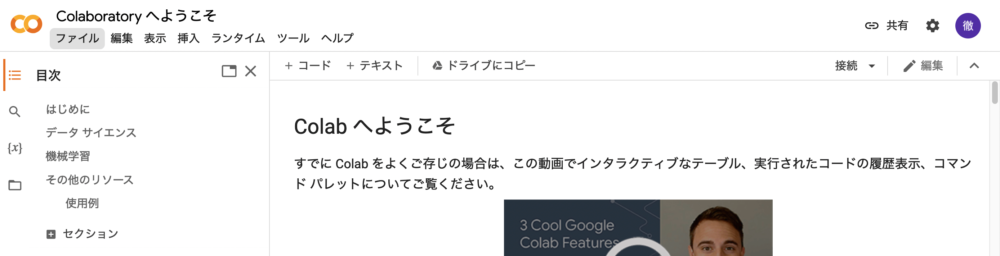

+ 次の画面となったら No3 へ. 

   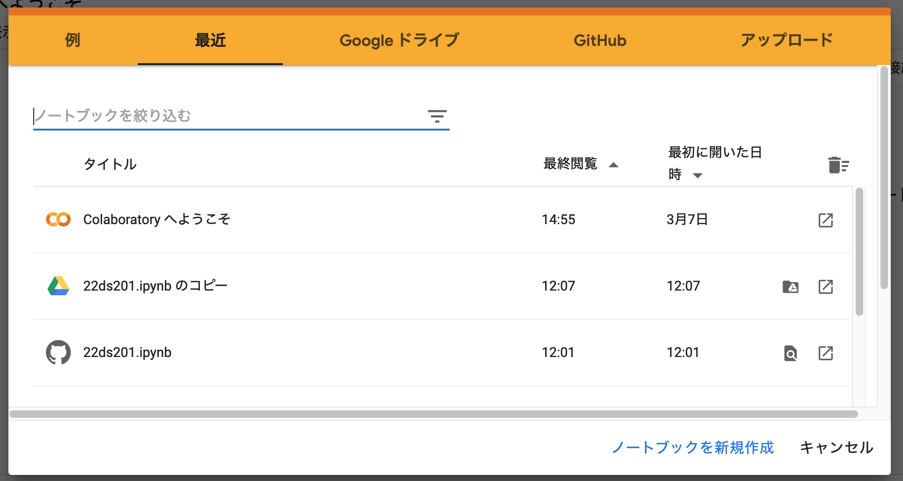

## 2 メニューのファイル>ノートブックを選択

   

   

## 3 指定されたファイルを選択

   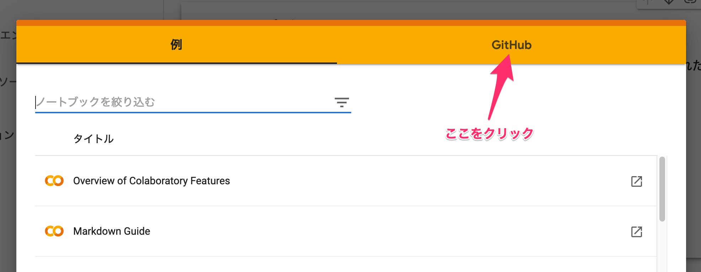

   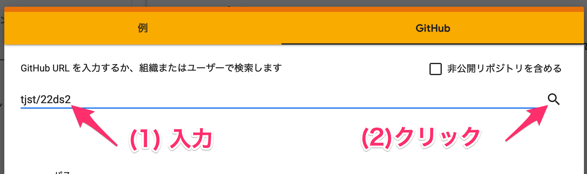

   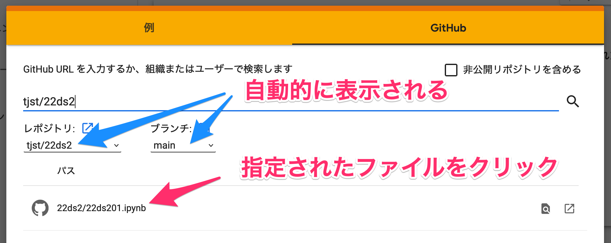

## 4 読込後

+ 「ドライブにコピー」をクリック

   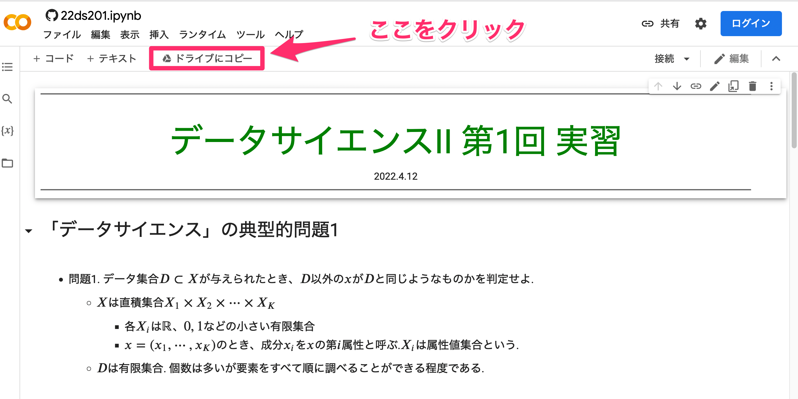

## 5 ログインが必要な場合

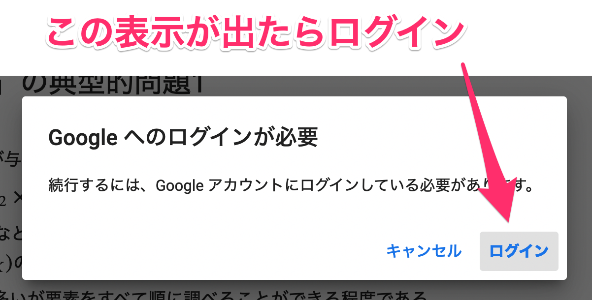

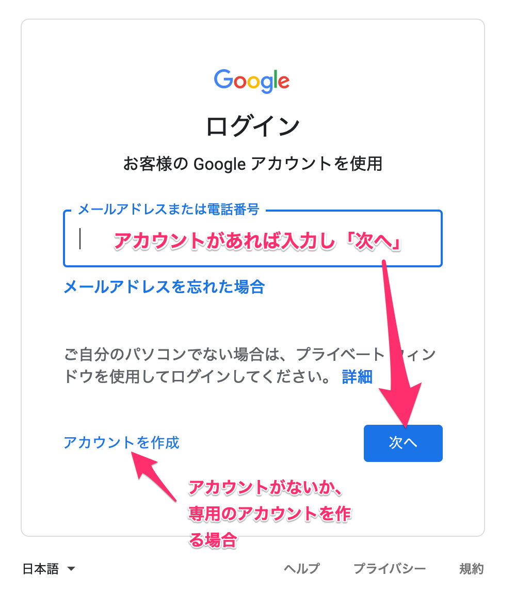

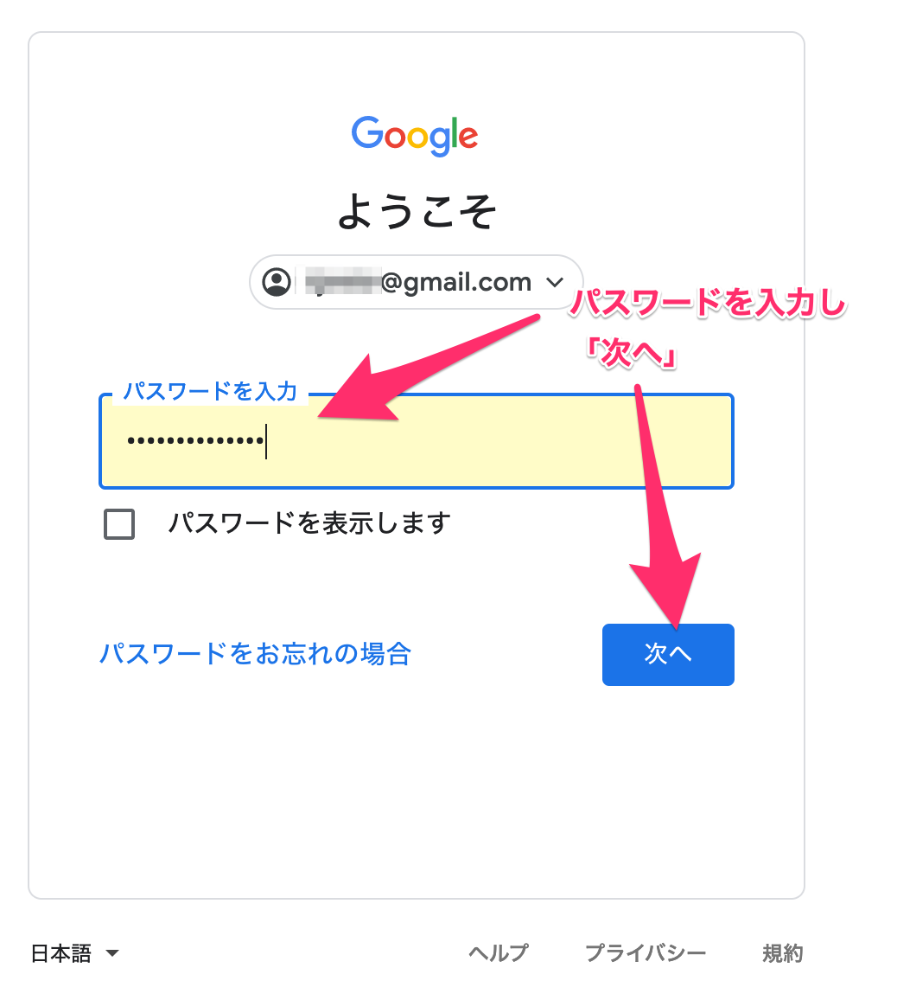

## 6 ドライブにコピーする

   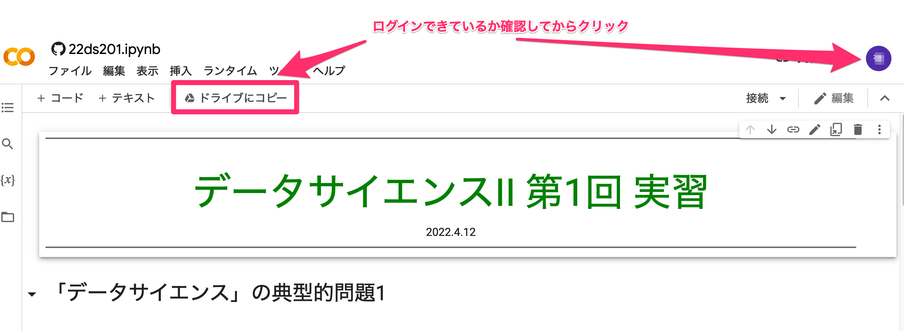

   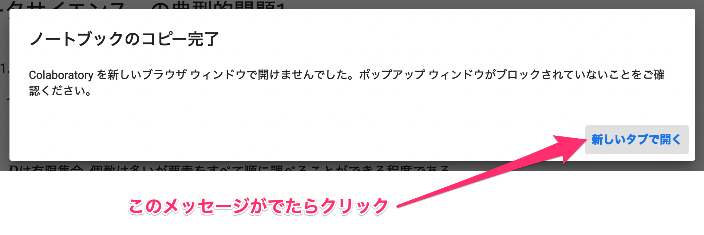

   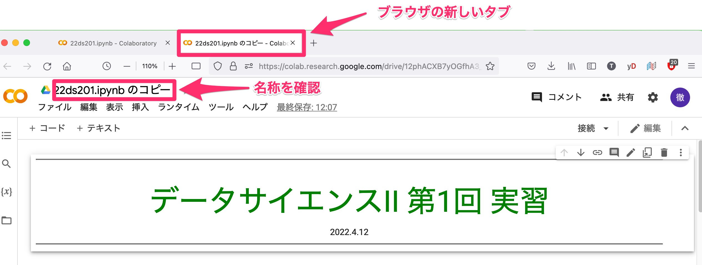

+ 以上で準備終了
