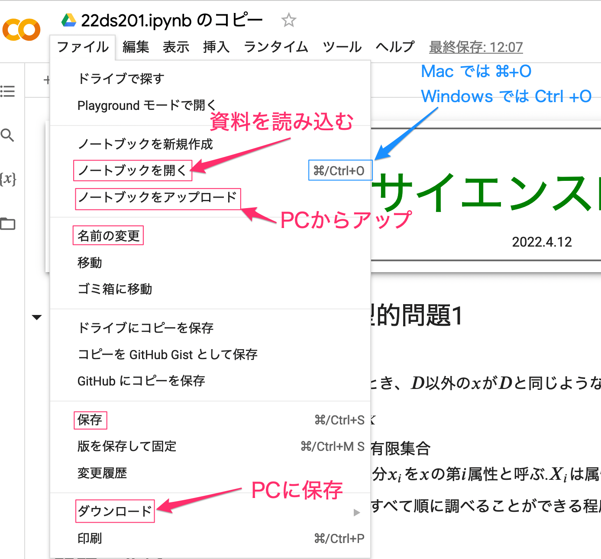
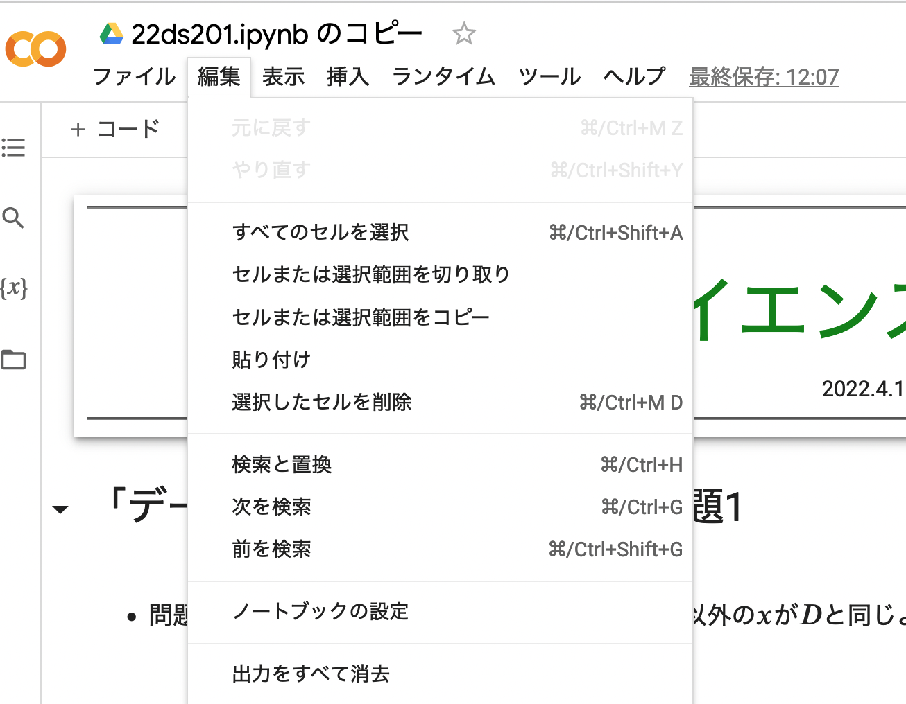
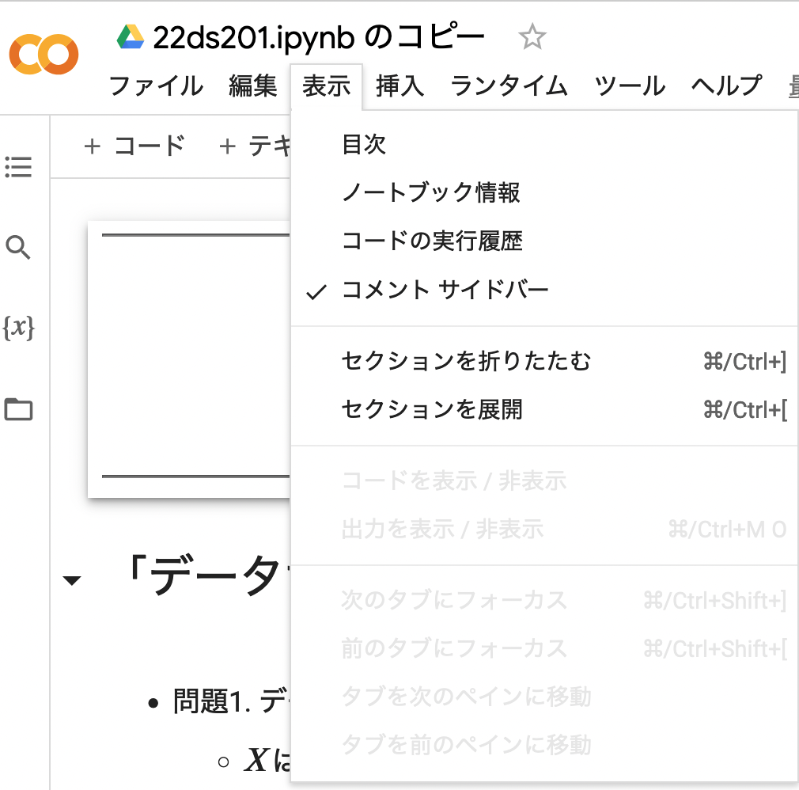
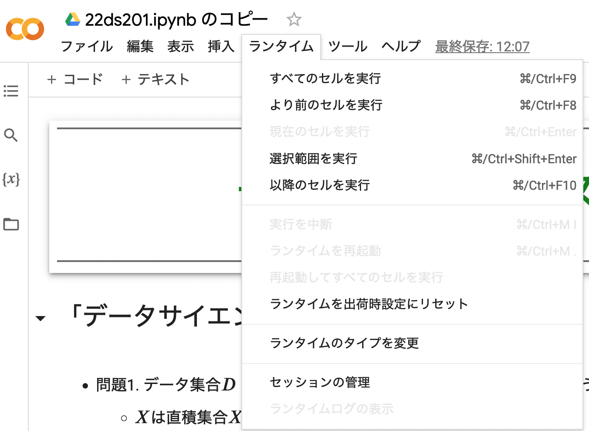
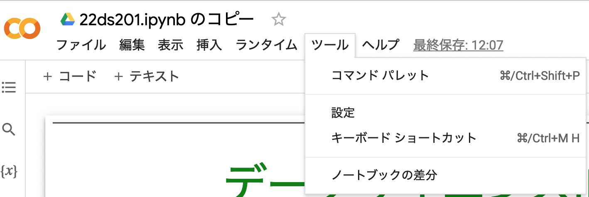
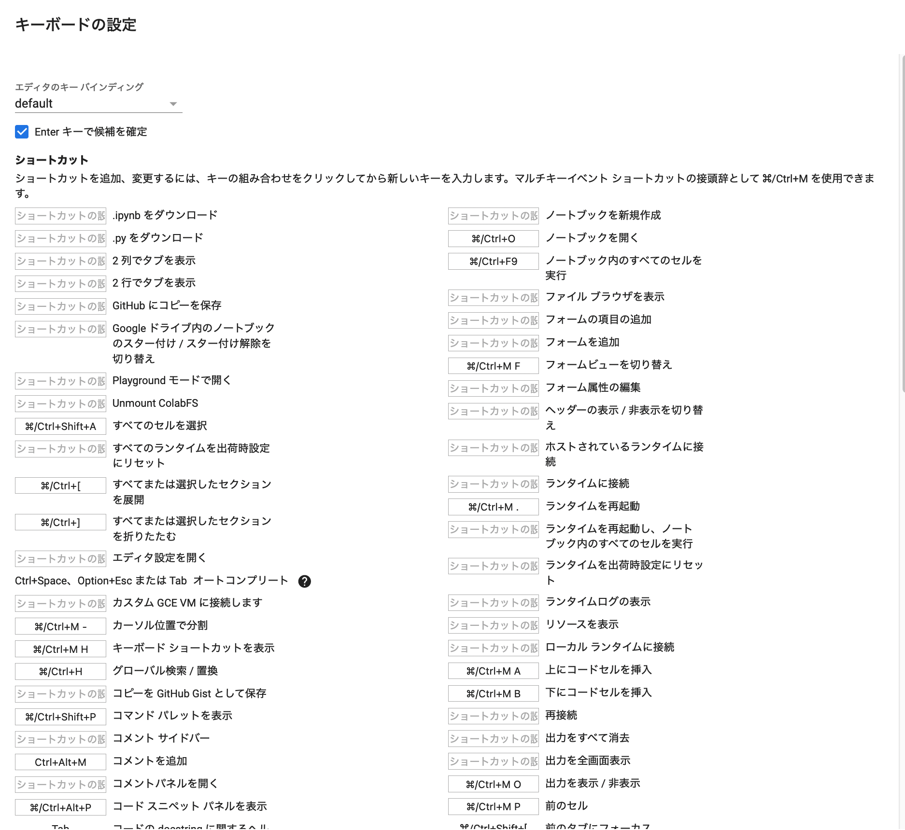
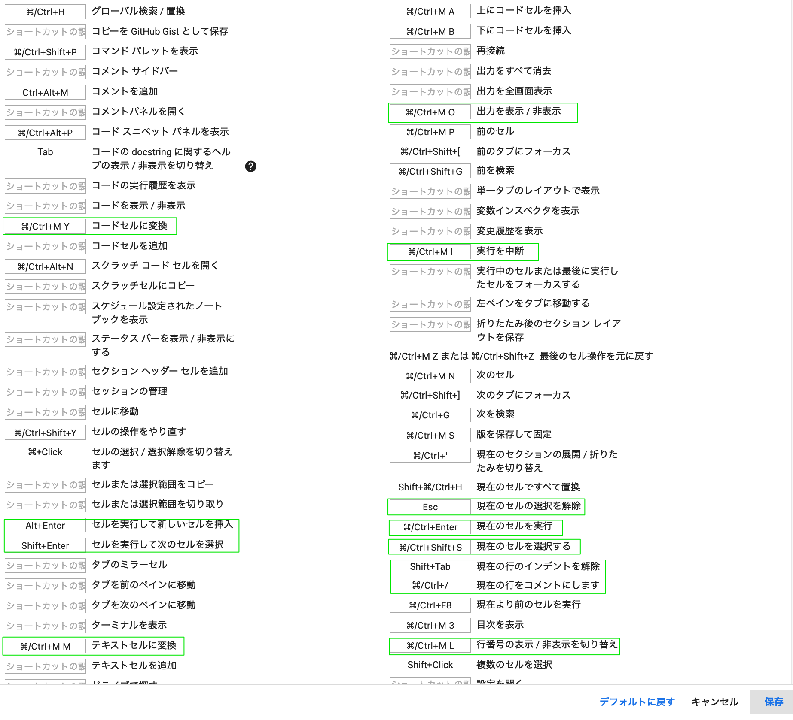
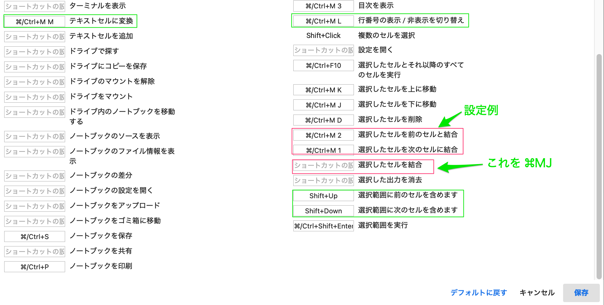

# Google Colaborator の基本的な使いかた

## 1 初級. 基本的セル操作
+ 概要. 使い方はjupyter notebook とほぼ同じである。セルにはテキストセルとコードセルとがある。プログラムはコードセルに入力し、説明やコメントなどはテキストセルに入力する。コードセルを「実行」するとプログラムが実行され結果が出力セルに表示される。テキストセルを実行すると内容が整形されて表示される。

+ (セルの実行) セルをクリックして焦点セルにする。上下矢印でも焦点セルを変更できる。

    + 焦点のコードセルを実行するには、行頭の黒丸に▶の印をクリックする。あるいは、`Shift+改行`
	+ 焦点のテキストセルを整形するには `Shift+改行`。テキストセルを編集するにはダブルクリックする。

+ (セルの作成) 選択したセルの少し下にカーソルを置くと`＋コード、＋テキスト` と表示されるので、クリックすると次行にセルが作成される。

    + 上に作成するには、選択したセルの少し上にカーソルをおけばよい.

    + コードセルをテキストセルに変換するには`⌘MM`、テキストセルをコードセルに変換するには`⌘MY`. 

+ (セルの削除) 選択したセルを削除するには、セル右上にあるメニューのゴミ箱をクリックする.  

+ (目次の表示) 左の垂直メニューの目次アイコンのクリックで、目次パネルの表示・非表示ができる。

+ コードセルで

   + 選択行をインデントは`TAB`、選択行のインデントの解除は `Shift+Tab`

   + 選択行をコメントする・コメントを外す `⌘/`

## 2 初級. ノートブックの基本操作
+ (名称変更) メニュー＞ ファイル＞ 名前の変更

+ (コピーの作成) メニュー＞ ファイル＞ ドライブにコピーを保存
    + そのあと「新しいタブで開く」クリック

+ (保存) メニュー＞ ファイル＞ 保存

+ (自分のPCにダウンロード) メニュー＞ ファイル＞ ダウンロード

<!-- ##メニュー＞編集 -->
<!-- 

 -->

<!-- ##メニュー＞表示 -->
<!--  -->

## 3 初級. メニュー＞ランタイム

<!-- ##メニュー＞ツール -->
<!--  -->

## 4 中級. セル操作(2) 
+ セルの選択

    + 焦点セルを選択する: `[Ctr][Shift]S` (セルが青色になる)

    + 複数セルの選択. 焦点セルからShiftを押しながら矢印を押す. 選択されたセルが青色となる。

    + 選択を解除するにはどこかをクリックすればよい.

+ 選択セルの操作

    + (コピー) `メニュー＞編集＞セルまたは選択範囲をコピー`  ( `⌘C` )

    + (カット) `メニュー＞編集＞セルまたは選択範囲を切り取り`

    + (ペースト)`メニュー＞編集＞貼り付け` ( `⌘V` )

    + １セルに結合. 右のメニューの縦３点アイコンをクリックし「セルを結合する」を選択 .
	
+ コードセルの行番号の表示・非表示 `⌘ML`

+ (参考) 焦点セルを下のセルと結合. 
`メニュー＞ツール＞コマンドパレット＞選択したセルを次のセルに結合`
  (キーボードショートカットで `⌘M1`などに設定すると便利 )
	   
+ セルの分割. 分割する位置にカーソルを置いて `⌘M-` (-はマイナス)

## 5 上級
+ キーボードショートカット. 
`メニュー＞ツール＞キーボードショートカット`で、よく使う操作にキーを割り当てることができる。

+ 例. 緑のものはよく使うもの. 赤は設定例.

<!-- 

 -->

